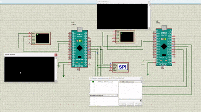

# STM32 SPI and USART Communication Project

This project demonstrates SPI and USART communication on the STM32F103C6 microcontroller. It includes configurations for both master and slave modes for SPI and supports data transmission and reception via USART.

## Features
- **USART Communication**: Configured for 115200 baud rate with interrupt-based reception.
- **SPI Communication**: Configurable for master or slave mode with optional software/hardware NSS management.
- **Clock Initialization**: Automatic clock enable for GPIO, AFIO, and other peripherals.
- **Interrupt Handling**:
  - USART interrupt for receiving and echoing data.
  - SPI interrupt for receiving data in slave mode and forwarding it to USART.

## Requirements
- **Hardware**:
  - STM32F103C6 microcontroller
  - USB-to-Serial adapter for USART communication
  - Proteus for simulation (optional)
- **Software**:
  - Keil MicroVision for building and debugging
  - STM32 Peripheral Drivers (provided in the repository)

---

## Proteus Simulation

### Steps to Simulate in Proteus:
1. Open Proteus Design Suite.
2. Create a new project and add the following components:
   - STM32F103C6 microcontroller
   - Virtual Terminal for USART communication
   - SPI-compatible slave/memory device (if testing SPI in master mode)
3. Wire the components as per the connection diagram:
   - Connect USART TX and RX pins to the Virtual Terminal.
   - For SPI:
     - `MOSI`, `MISO`, `SCK`, and `NSS` pins to the SPI slave device.
4. Configure the clock and power connections for STM32.
5. Load the compiled `.hex` or `.bin` file into the STM32 microcontroller in Proteus.
6. Run the simulation and observe the communication in the Virtual Terminal and SPI device.

### Simulation Video

