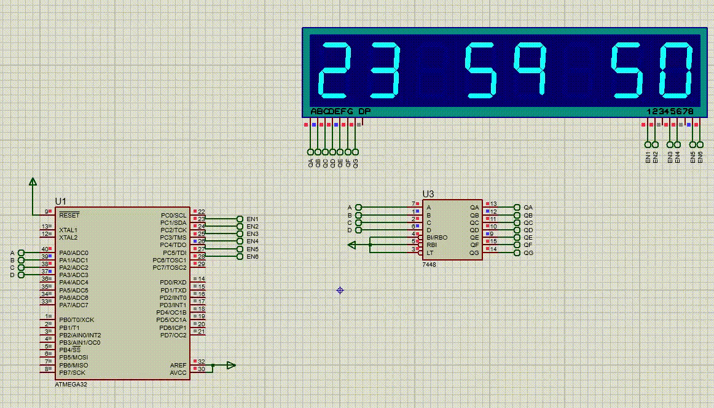

# Digital Clock using 7-Segment Display with ATmega32

This project implements a simple digital clock on an ATmega32 microcontroller using a 6-digit 7-segment display to show hours, minutes, and seconds. The clock increments every second and uses two digits each for hours, minutes, and seconds.

## Simulation

To see the digital clock in action, view the simulation below:

## Features
- Displays time in `HH:MM:SS` format.
- Automatically increments the time every second.
- Wraps around after 23:59:59 back to 00:00:00.
- Uses a multiplexing technique to control a 6-digit 7-segment display.

## Circuit Components
- ATmega32 microcontroller
- 6-digit 7-segment display
- 7-segment display control and enable pins

## Code Overview

### Constants and Macros
- `MCU_CLK_FREQ`: Microcontroller clock frequency (1 MHz).
- `SET_BIT`, `RESET_BIT`, `TOGGLE_BIT`, `READ_BIT`: Macros for bit manipulation.
- `CATHODE_7SEG_CRTL_PIN` and `ANODE_7SEG_CRTL_PIN`: Define the control pins for the 7-segment display.
- `EN1` to `EN6`: Define the enable pins for each digit in the 6-digit display.
- `DELAY_TIME`: Delay time used for multiplexing (5 ms).

### Functions

#### `GPIO_Init()`
Initializes `PORTA` as the data port for the 7-segment display and `PORTC` as the control port for enabling each digit.

#### `myDelay(uint32_t delay)`
A simple delay function that loops for the specified delay count.

#### Main Function
The `main` function implements the clock logic:
- It initializes the GPIOs and enters an infinite loop.
- Within each second, it:
  - Iterates through each digit of hours, minutes, and seconds.
  - Updates the 7-segment display by enabling each digit one by one.
  - Delays to give each digit visibility using multiplexing.
- After every 1000 ms, it increments the `seconds` variable.
- Rolls over minutes and hours appropriately when their maximum values are reached.

## Usage

1. **Compile and Upload**: Use an AVR-compatible compiler and programmer to compile and upload the code to an ATmega32 microcontroller.
2. **Connect 7-Segment Display**: Connect a 6-digit 7-segment display with the appropriate anode/cathode configuration and enable pins for each digit.

